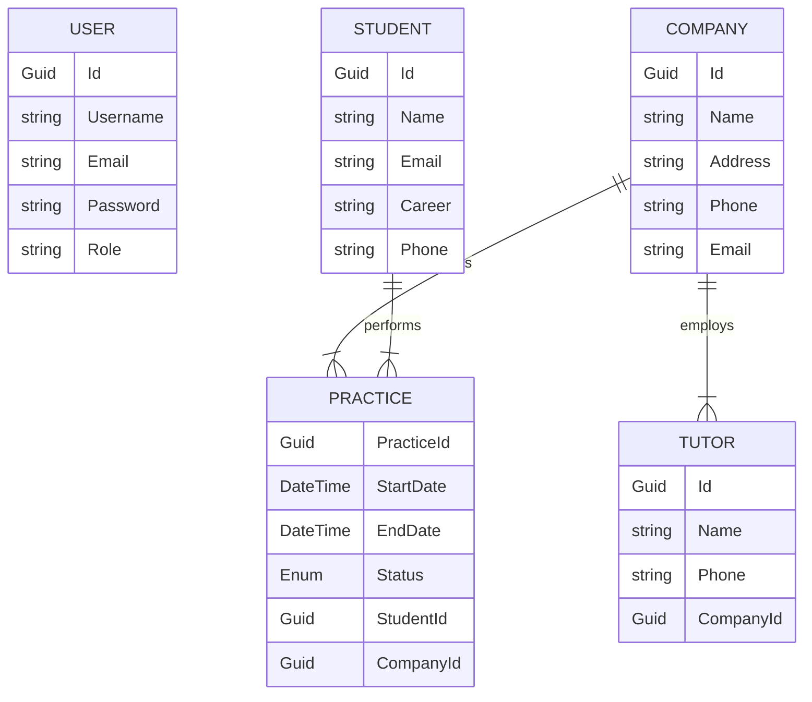

# Internship Management System API

## 📖 About the Project

The **Internship Management System** is a comprehensive backend solution designed to bridge the gap between academic theory and professional practice. University internships are a critical component of higher education, providing students with the opportunity to apply their knowledge in real-world scenarios, develop soft skills, and build professional networks.

This API facilitates the administrative and operational flow of this tripartite relationship between:
1.  **The University:** Which needs to track student progress and validate credits.
2.  **The Company:** Which offers positions and assigns mentors (Tutors).
3.  **The Student:** Who executes the internship.

**Key Features:**
* **Centralized Management:** CRUD operations for Students, Companies, and Tutors.
* **Practice Tracking:** Manages the lifecycle of an internship (Pending, Active, Finished).
* **Role-Based Security:** strict separation between Administrators and regular Users.
* **Scalable Architecture:** Built on .NET with a solid Entity Framework Core foundation.

---
## 🚀 Live Demo & Documentation

### 🌐 Deployment
The API is currently deployed on Railway. You can access the base URL here:
https://pasantiastw-production.up.railway.app

### 📄 Swagger UI
Interactive documentation is available to test endpoints directly from the browser.
https://pasantiastw-production.up.railway.app/swagger/index.html

---

## 🛠 Tech Stack

* **Framework:** .NET 9 (ASP.NET Core Web API)
* **Database:** PostgreSQL
* **ORM:** Entity Framework Core 
* **Authentication:** JWT Bearer
* **Documentation:** Swagger and Postman
* **Environment Management:** DotNetEnv

---

## 📦 System Modules

The application is structured around the following core entities:

* **Auth:** Handles user registration (`Register`) and access control (`Login`).
* **Students:** Manages candidate information (Name, Phone, Major/Career).
* **Companies:** Organizations offering internship positions.
* **Tutors:** Professionals assigned by companies to supervise students. *Note: A Tutor belongs to a specific Company.*
* **Practices:** The core entity linking a **Student** to a **Company** (and potentially a Tutor) for a specific period. It tracks the status (Pending, Active, Finished).

---

## 🔐 Authentication & Authorization (JWT)

This API uses **JSON Web Tokens (JWT)** for security. Most endpoints are protected and require a valid token to be accessed.

### How it works:
1.  **Register:** Create a new account using `/api/Auth/register`.
2.  **Login:** Authenticate using `/api/Auth/login`. The response will contain a `token` string.
3.  **Access:** For any subsequent request to protected endpoints (Students, Companies, etc.), you must include the token in the **Authorization Section**, look for **Bearer Token** and place the created token in the slot.

### Roles
The system strictly enforces two roles:
1.  **Admin:** Full access to all endpoints, including deleting records and managing sensitive data.
2.  **User:** Read-only access or limited write permissions (depending on specific endpoint configuration).

---

## 📊 Entity-Relationship Diagram (ERD)

The following diagram illustrates the data model and relationships between entities in the PostgreSQL database:
Note: Relationships handle cascade deletions where appropriate (e.g., deleting a Company removes its associated Practices).


## 📡 API Endpoints

| Module | Method | Endpoint | Description | Auth Required |
| :--- | :---: | :--- | :--- | :---: |
| **Auth** | `POST` | `/api/Auth/register` | Register a new user (`Admin` or `User`). | ❌ |
| **Auth** | `POST` | `/api/Auth/login` | Authenticate and retrieve the Bearer Token. | ❌ |
| **Student** | `GET` | `/api/Student` | Retrieve all registered students. | ✅ |
| **Student** | `GET` | `/api/Student/{id}` | Get a specific student by ID. | ✅ |
| **Student** | `POST` | `/api/Student` | Register a new student. | ✅ |
| **Student** | `PUT` | `/api/Student/{id}` | Update student contact/academic info. | ✅ |
| **Student** | `DELETE` | `/api/Student/{id}` | Remove a student. | ✅ |
| **Company** | `GET` | `/api/Company` | List all partner companies. | ✅ |
| **Company** | `POST` | `/api/Company` | Register a new company. | ✅ |
| **Company** | `PUT` | `/api/Company/{id}` | Update company details. | ✅ |
| **Company** | `DELETE` | `/api/Company/{id}` | Delete a company. | ✅ |
| **Tutor** | `GET` | `/api/tutor` | List all corporate tutors. | ✅ |
| **Tutor** | `POST` | `/api/tutor` | Create a tutor linked to a Company. | ✅ |
| **Practice** | `GET` | `/api/practice` | List all internships. | ✅ |
| **Practice** | `POST` | `/api/Practice` | Create a new internship (Links Student & Company). | ✅ |
| **Practice** | `DELETE` | `/api/practice/{id}` | Delete an internship record. | ✅ |

---

## 📝 Request & Response Examples

### 1. Authentication (Register)
**Endpoint:** `POST /api/Auth/register`

**Body:**
```json
{
    "Email": "admin@university.edu",
    "Username": "SuperAdmin",
    "Password": "SecurePassword123!",
    "Role": "Admin"
}
