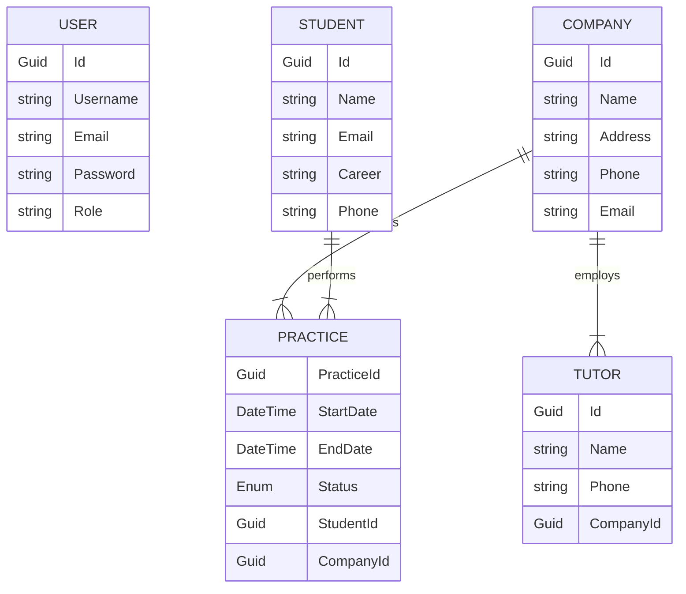

# Internship Management System API

## 📖 About the Project

The **Internship Management System** is a comprehensive backend solution designed to bridge the gap between academic theory and professional practice. University internships are a critical component of higher education, providing students with the opportunity to apply their knowledge in real-world scenarios, develop soft skills, and build professional networks.

This API facilitates the administrative and operational flow of this tripartite relationship between:
1.  **The University:** Which needs to track student progress and validate credits.
2.  **The Company:** Which offers positions and assigns mentors (Tutors).
3.  **The Student:** Who executes the internship.

**Key Features:**
* **Centralized Management:** CRUD operations for Students, Companies, and Tutors and Practices.
* **Practice Tracking:** Manages the lifecycle of an internship (Pending, Active, Finished).
* **Role-Based Security:** strict separation between Administrators and regular Users.
* **Scalable Architecture:** Built on .NET with a solid Entity Framework Core foundation.
---
## 🏗️ Software Architecture

The system follows a **Layered Architecture** utilizing the **Repository Pattern**, which ensures clean, maintainable, and decoupled code:

* **Controllers:** Handle incoming HTTP requests.
* **Services:** Contain business logic and validations.
* **Repositories:** Manage direct data access using Entity Framework Core.
* **Data/Models:** Definition of entities and database context.
---
## 🚀 Live Demo & Documentation

### 🌐 Deployment
The API is currently deployed on Railway. You can access the base URL here:
https://pasantiastw-production.up.railway.app

### 📄 Swagger UI
Interactive documentation is available to test endpoints directly from the browser.
https://pasantiastw-production.up.railway.app/swagger/index.html

---

## 🛠 Tech Stack

* **Framework:** .NET 9 (ASP.NET Core Web API)
* **Database:** PostgreSQL
* **ORM:** Entity Framework Core 
* **Authentication:** JWT Bearer
* **Documentation:** Swagger and Postman
* **Environment Management:** DotNetEnv

---

## 📦 System Modules

The application is structured around the following core entities:

* **Auth:** Handles user registration (`Register`) and access control (`Login`).
* **Students:** Manages candidate information (Name, Phone, Major/Career).
* **Companies:** Organizations offering internship positions.
* **Tutors:** Professionals assigned by companies to supervise students. *Note: A Tutor belongs to a specific Company.*
* **Practices:** The core entity linking a **Student** to a **Company** (and potentially a Tutor) for a specific period. It tracks the status (Pending, Active, Finished).

---

## 🔐 Authentication & Authorization (JWT)

This API uses **JSON Web Tokens (JWT)** for security. Most endpoints are protected and require a valid token to be accessed.

### How it works:
1.  **Register:** Create a new account using `/api/Auth/register`.
2.  **Login:** Authenticate using `/api/Auth/login`. The response will contain a `token` string.
3.  **Access:** For any subsequent request to protected endpoints (Students, Companies, etc.), you must include the token in the **Authorization Section**, look for **Bearer Token** and place the created token in the slot.

### User Roles
The API handles two strict roles defined upon user creation:

| Role | Description | Permissions |
| :--- | :--- | :--- |
| **User** | Students or general users. | Read-only access to their own resources and general lists. |
| **Admin** | University administrators. | Full access (CRUD). The only role capable of **Creating** and **Deleting** master entities (Students, Companies, Tutors). |

---

## 📡 Endpoints

### 👤 Auth (Authentication)
| Method | Endpoint | Description | Auth |
| :--- | :--- | :--- | :--- |
| `POST` | `/api/Auth/register` | Register a new user (User/Admin). | 🔓 Public |
| `POST` | `/api/Auth/login` | Log in and obtain Access/Refresh Tokens. | 🔓 Public |
| `POST` | `/api/Auth/refresh` | Renew Access Token using a Refresh Token. | 🔓 Public |
| `POST` | `/api/Auth/logout` | Log out and delete Refresh Token from database. | 🔐 Auth |

### 🎓 Student
| Method | Endpoint | Description | Auth |
| :--- | :--- | :--- | :--- |
| `GET` | `/api/Student` | List all students. | 🔐 Auth |
| `GET` | `/api/Student/{id}` | Get details of a specific student. | 🔐 Auth |
| `POST` | `/api/Student` | Register a new student. | 🛡️ **Admin** |
| `PUT` | `/api/Student/{id}` | Update contact/degree info. | 🔐 Auth |
| `DELETE` | `/api/Student/{id}` | Delete a student. | 🛡️ **Admin** |

### 🏢 Company
| Method | Endpoint | Description | Auth |
| :--- | :--- | :--- | :--- |
| `GET` | `/api/Company` | List all companies. | 🔐 Auth |
| `GET` | `/api/Company/{id}` | Get details (includes Tutor and Practices). | 🔐 Auth |
| `POST` | `/api/Company` | Register a new company. | 🛡️ **Admin** |
| `PUT` | `/api/Company/{id}` | Update company details. | 🔐 Auth |
| `DELETE` | `/api/Company/{id}` | Delete a company. | 🛡️ **Admin** |

### 👨‍🏫 Tutor
| Method | Endpoint | Description | Auth |
| :--- | :--- | :--- | :--- |
| `GET` | `/api/Tutor` | List all tutors. | 🔐 Auth |
| `GET` | `/api/Tutor/{id}` | Get a specific tutor. | 🔐 Auth |
| `POST` | `/api/Tutor` | Assign a tutor to a company. | 🛡️ **Admin** |
| `PUT` | `/api/Tutor/{id}` | Edit tutor details. | 🛡️ **Admin** |
| `DELETE` | `/api/Tutor/{id}` | Delete a tutor. | 🛡️ **Admin** |

### 📋 Practice (Internships)
| Method | Endpoint | Description | Auth |
| :--- | :--- | :--- | :--- |
| `GET` | `/api/Practice` | List all internships. | 🔐 Auth |
| `GET` | `/api/Practice/{id}` | Get internship details. | 🔐 Auth |
| `POST` | `/api/Practice` | Create a new internship (Link Student-Company). | 🛡️ **Admin** |
| `PUT` | `/api/Practice/{id}` | Update status or end date. | 🛡️ **Admin** |
| `DELETE` | `/api/Practice/{id}` | Delete internship record. | 🛡️ **Admin** |

---

## ⏱️ TimeGate (Rate Limiting)

The system implements a **TimeGate (Rate Limiter)** configured in `Program.cs` to protect the API against abuse and Denial of Service (DoS) attacks.

* **Configuration:** FixedWindow ("Fixed").
* **Limit:** Maximum **10 requests per minute**.
* **Queue Limit:** Allows up to **3 requests** to be queued if the limit is reached.
* **Exceeded Response:** The server will respond with a rejection status code (typically `503 Service Unavailable` or `429 Too Many Requests` depending on final configuration) when the limit and queue are exhausted.

---

## 🛠️ Installation & Configuration

#### Prerequisites
* .NET 9.0 SDK installed.
* Docker Desktop installed and running.
* Postman (optional, for testing).

#### Installation Steps

1.  **Clone the repository:**
    ```bash
    git clone [https://github.com/YOUR_USER/PasantiasTW](https://github.com/YOUR_USER/PasantiasTW.git)
    cd PasantiasTW
    ```

2.  **Configure Environment Variables:**
    Create a `.env` file in the root directory with the following content (based on `docker-compose.yml`):
    ```env
    POSTGRES_DB=pasantias_db
    POSTGRES_USER=postgres
    POSTGRES_PASSWORD=supersecret
    JWT_KEY=ThisIsASuperSecretKeyLongEnoughForJWTToWork123!
    JWT_ISSUER=PasantiasApi
    JWT_AUDIENCE=PasantiasClient
    ```

3.  **Launch Infrastructure (Docker):**
    This will automatically start the PostgreSQL database.
    ```bash
    docker-compose up -d
    ```

4.  **Run Migrations (Create Tables):**
    ```bash
    dotnet tool install --global dotnet-ef
    dotnet ef migrations add InitialCreate
    dotnet ef database update
    ```

5.  **Run the API:**
    ```bash
    dotnet run
    ```
#### The API will be available at the port indicated in the console.
---
## 🧪 Testing with Postman

It is recommended to follow this specific order to test the complete functionality:

1.  **Auth Folder:** Execute `Register` to create an **Admin** user and then `Login`.
2.  **Configuration:** Copy the `token` received in the Login response. In Postman, go to the **Authorization** tab, select **Bearer Token**, and paste the token.
3.  **Company Folder:** Create a company (`POST`). Copy its `id`.
4.  **Student Folder:** Create a student (`POST`). Copy their `id`.
5.  **Tutor Folder:** Create a tutor (`POST`) using the `companyId` created in step 3.
6.  **Practice Folder:** Create an internship (`POST`) using the `studentId` and `companyId` obtained previously.
7.  **Validation:** Use the `GET` endpoints in each folder to verify that the data has been saved and relationships are correctly established.

---
## 📝 Request Examples (Body)

### 1. Register User
**POST** `/api/Auth/register`
```json
{
    "username": "AdminUser",
    "email": "admin@university.edu",
    "password": "SecurePassword123!",
    "role": "Admin"
}
```
### 2. Login User
**POST** `/api/Auth/login`
```json
{
    "email": "admin@university.edu",
    "password": "SecurePassword123!"
}
```
### 3. Create Student
**POST** `/api/Student`
```json
{
    "name": "John Doe",
    "email": "john.doe@student.edu",
    "carrer": "Systems Engineering",
    "phone": "70123456"
}
```
### 4. Create Company
**POST** `/api/Company`
```json
{
    "name": "Tech Solutions Inc.",
    "address": "123 Innovation Blvd",
    "phone": "44556677",
    "email": "contact@techsolutions.com"
}
```
### 5. Create Tutor
**POST** `/api/Tutor`
```json
{
  "name": "Alice Smith",
  "phone": "60012345",
  "companyId": "a1b2c3d4-e5f6-7890-1234-567890abcdef"
}
```
### 6. Create Practice
**POST** `/api/Practice`
```json
{
  "studentId": "3fa85f64-5717-4562-b3fc-2c963f66afa6",
  "companyId": "a2b45f64-5717-4562-b3fc-2c963f66afa1",
  "startDate": "2025-08-01T00:00:00Z"
}
```
---
## 📄 Response Examples
### 1. Login Response (200 OK)
```json
{
    "user": {
        "id": "3fa85f64-5717-4562-b3fc-2c963f66afa6",
        "username": "AdminUser",
        "email": "admin@university.edu"
    },
    "role": "Admin",
    "accessToken": "eyJhbGciOiJIUzI1NiIsInR5cCI6IkpXVCJ9...",
    "refreshToken": "Ag6... (Secure String)",
    "tokenType": "Bearer",
    "expiresIn": 3600
}
```
### 2. Company Response (201 CREATED, 200 OK)
```json
{
    "companyId": "a2b45f64-5717-4562-b3fc-2c963f66afa1",
    "name": "Tech Solutions Inc.",
    "address": "123 Innovation Blvd",
    "phone": "44556677",
    "email": "contact@techsolutions.com",
    "tutor": {
        "id": "b1b2c3d4-e5f6-7890-1234-567890abcdef",
        "name": "Alice Smith",
        "phone": "60012345",
        "company": "Tech Solutions Inc.",
        "companyId": "a2b45f64-5717-4562-b3fc-2c963f66afa1"
    },
    "students": [
        {
                "id": "1d638759-160e-4052-bd9b-10c60590633a",
                "name": "Mariano Soria Rojas",
                "email": "mariano.soria@example.com",
                "carrer": "Systems Engineering ",
                "phone": "78842256"
        }
    ],
    "practices": [
        {
            "practiceId": "d4e55f64-5717-4562-b3fc-2c963f66afa9",
            "status": 0,
            "startDate": "2025-11-27T10:00:00Z",
            "endDate": "2026-01-27T10:00:00Z"
        }
    ]
}
```
### 3. Tutor Response (201 CREATED, 200 OK)
```json
{
    "id": "b1b2c3d4-e5f6-7890-1234-567890abcdef",
    "name": "Alice Smith",
    "phone": "60012345",
    "company": "Tech Solutions Inc.",
    "companyId": "a2b45f64-5717-4562-b3fc-2c963f66afa1"
}
```
### 4. Student Response (201 CREATED, 200 OK)
```json
{
    "id": "1d638759-160e-4052-bd9b-10c60590633a",
    "name": "Mariano Soria Rojas",
    "email": "mariano.soria@example.com",
    "carrer": "Systems Engineering ",
    "phone": "78842256"
}
```
### 5. Practice Response (201 CREATED,200 OK)
```json
{
    "practiceId": "3beaf7ed-722c-4b71-8aef-d0c9e98c0374",
    "startDate": "2025-08-01T00:00:00Z",
    "endDate": "2026-01-28T02:58:44.0810282Z",
    "status": 0,
    "student": {
        "studentId": "1d638759-160e-4052-bd9b-10c60590633a",
        "name": "Mariano Soria Rojas",
        "career": "Ingeniería Civil"
    },
    "company": {
        "companyId": "5e9c4721-233a-4c17-81a9-3022dd99c73b",
        "name": "TechCorp Bolivia"
    }
}
```
---

## 📊 Entity-Relationship Diagram (ERD)

The following diagram illustrates the data model and relationships between entities in the PostgreSQL database:
Note: Relationships handle cascade deletions where appropriate (e.g., deleting a Company removes its associated Practices).


